# Top 20 AI Algorithms: Complete Guide with Use Cases and Sample Projects for Developers

Machine learning algorithms form the backbone of artificial intelligence applications, from predictive analytics to autonomous systems. While the field often seems dominated by complex deep learning models, a core set of foundational algorithms remains indispensable for building practical, scalable solutions.

This guide explores the top 20 AI algorithms, providing in-depth explanations of their mechanics, real-world use cases, and actionable sample projects. Designed for technical professionals—including solo AI architects, freelance makers, enterprise transitioners, hobbyist hackers, academic researchers, startup founders, and independent consultants—this resource emphasizes open-source tools, local-first implementations, and monetization opportunities.

Whether you're prototyping on a budget, modernizing legacy systems, or launching a side hustle, these algorithms offer proven techniques for extracting insights from data.

## 1. Linear Regression: Predicting Numerical Outcomes

Linear regression establishes a linear relationship between input variables and a continuous output, minimizing the difference between predicted and actual values.

**Use Case:** Linear regression is widely used in real estate for predicting property values based on various features such as square footage, number of bedrooms, bathrooms, location, age of the property, and proximity to amenities. It's also applied in finance for predicting stock prices or economic indicators, in healthcare for estimating patient outcomes based on clinical data, and in marketing for forecasting sales based on advertising spend and other variables. For example, a real estate company might use linear regression to provide automated valuations for properties listed on their platform, helping sellers set competitive prices and buyers make informed decisions.

**Why It Matters:** As a solo AI architect prioritizing data privacy, you can deploy linear regression models locally using scikit-learn, ensuring sensitive real estate data remains on-device without cloud dependencies.

**Sample Project:** In this project, you'll start by collecting or simulating a dataset of housing prices with features such as square footage, number of bedrooms, number of bathrooms, age of the house, and location (encoded as numerical values). Using Python's scikit-learn library, you'll preprocess the data by handling missing values, encoding categorical variables, and splitting the dataset into training and testing sets. Then, you'll train a linear regression model on the training data, evaluate its performance using metrics like mean squared error and R-squared, and fine-tune hyperparameters if necessary. Finally, you'll create a simple web interface using Flask or Streamlit where users can input property features and receive price predictions. This project not only teaches the fundamentals of linear regression but also demonstrates end-to-end ML pipeline development, from data preparation to deployment. Freelance makers can use this as a template for client projects, such as building custom pricing tools for real estate agencies, and monetize it by offering the tool as a SaaS product or charging for custom implementations.

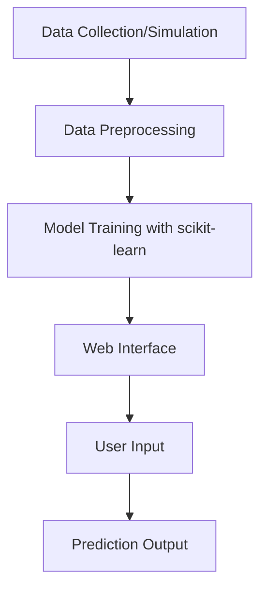

## 2. Logistic Regression: Binary Classification

Logistic regression applies a sigmoid function to linear regression outputs, producing probabilities for binary outcomes.

**Use Case:** Logistic regression is commonly used for binary classification tasks such as email spam detection, where it determines if an incoming message is spam or legitimate based on features like word frequency, sender reputation, and message length. It's also applied in medical diagnosis for predicting disease presence (e.g., cancer detection from symptoms), in credit risk assessment for approving loans, and in marketing for predicting customer conversion. For instance, email providers like Gmail use logistic regression as part of their spam filtering systems to protect users from unwanted messages.

**Why It Matters:** Enterprise transitioners appreciate its interpretability for compliance-heavy environments, where explaining model decisions is crucial.

**Sample Project:** This project involves obtaining a dataset of labeled emails (spam and ham) from sources like the Enron dataset or UCI Machine Learning Repository. You'll preprocess the text data by tokenizing, removing stop words, and converting to feature vectors using techniques like TF-IDF. Using scikit-learn, you'll train a logistic regression model, tune hyperparameters with grid search, and evaluate performance with metrics such as accuracy, precision, recall, and F1-score. You'll then create a simple plugin for email clients like Thunderbird using Python's email parsing libraries, allowing real-time spam classification. This hands-on experience covers text preprocessing, model training, evaluation, and integration, making it ideal for hobbyists learning NLP basics or startup founders developing email security tools.

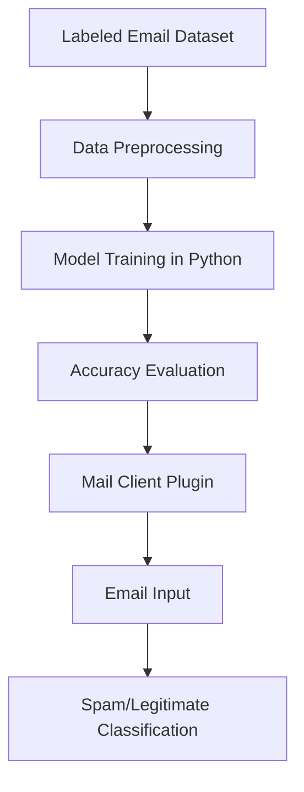

## 3. Decision Trees: Hierarchical Decision-Making

Decision trees split data into branches based on feature thresholds, creating a tree-like structure for classification or regression.

**Use Case:** Decision trees are used for customer churn prediction in telecom and subscription services by analyzing customer data such as usage patterns, billing history, and demographic information to identify factors leading to churn. They are also applied in medical diagnosis for classifying diseases based on symptoms, in finance for credit risk assessment, and in manufacturing for quality control. For example, telecom companies use decision trees to predict which customers are likely to cancel their service, allowing them to offer targeted retention incentives.

**Why It Matters:** Its transparency makes it ideal for academic researchers, who need to validate algorithmic decisions mathematically.

**Sample Project:** This project requires a dataset of customer information including features like tenure, monthly charges, contract type, and churn status. You'll use scikit-learn to preprocess the data, train a decision tree classifier, and visualize the tree structure with Graphviz to understand decision paths. You'll then compare its performance against ensemble methods like random forest using cross-validation and metrics such as accuracy and AUC-ROC. For DevOps engineers, this demonstrates how to containerize the model with Docker and integrate it into CI/CD pipelines using tools like Jenkins or GitHub Actions for automated testing and deployment.

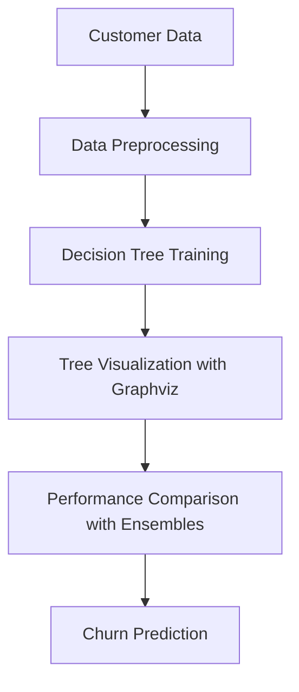

## 4. Random Forest: Ensemble Stability

Random forest combines multiple decision trees trained on random data subsets, reducing overfitting through averaging.

**Use Case:** Random forest is extensively used for stock price prediction by analyzing historical market data, incorporating features like trading volume, moving averages, and economic indicators. It's also applied in healthcare for predicting patient readmission risks, in fraud detection for identifying suspicious transactions, and in environmental science for modeling climate patterns. For example, financial institutions use random forest models to forecast market trends and inform investment strategies, reducing risks through ensemble predictions.

**Why It Matters:** Product-driven developers value its robustness for production systems, where reliability trumps marginal accuracy gains.

**Sample Project:** This project involves fetching historical stock data from financial APIs like Alpha Vantage or Yahoo Finance, incorporating features such as moving averages, volume, and technical indicators. You'll preprocess the data, train a random forest regressor, and backtest predictions on historical data to evaluate performance. Deploy the model as a REST API using Flask, allowing users to input stock symbols and receive forecasts. Side-hustle hackers can monetize this by offering premium signals or integrating with trading platforms.

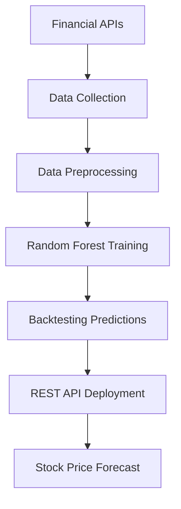

## 5. K-Means Clustering: Unsupervised Grouping

K-means partitions data into k clusters by minimizing intra-cluster distances.

**Use Case:** K-means clustering is used for customer segmentation in e-commerce and marketing by grouping customers based on purchasing behavior, demographics, and browsing patterns. It's also applied in image processing for color quantization, in bioinformatics for gene expression analysis, and in anomaly detection for identifying outliers in data. For example, online retailers use k-means to create customer personas, enabling personalized marketing campaigns and product recommendations.

**Why It Matters:** AI plugin developers can embed clustering in tools for data analysis plugins, enhancing productivity without external APIs.

**Sample Project:** This project involves collecting e-commerce data with features like purchase history, browsing time, and demographic info. You'll use scikit-learn to preprocess the data, apply k-means clustering with different k values, and evaluate using the elbow method. Visualize the clusters in 2D using PCA or t-SNE, and analyze characteristics of each cluster. Cross-platform architects can integrate this into mobile apps by deploying the model via TensorFlow Lite for real-time personalization.

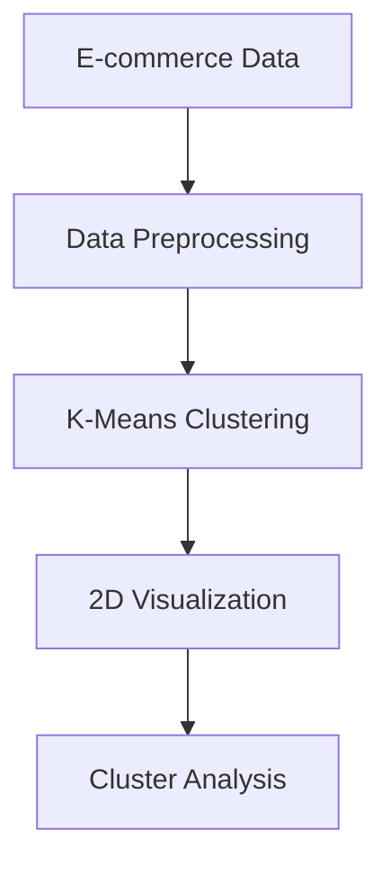

## 6. Naive Bayes: Probabilistic Classification

Naive Bayes assumes feature independence, using Bayes' theorem for fast classification.

**Use Case:** Naive Bayes is widely used for text classification tasks like sentiment analysis on social media posts, spam detection in emails, and document categorization. It's also applied in medical diagnosis for predicting diseases based on symptoms, in fraud detection for identifying suspicious transactions, and in recommendation systems for content filtering. For example, news aggregators use Naive Bayes to automatically classify articles into categories like politics, sports, or technology.

**Why It Matters:** Its speed and low resource requirements suit budget-conscious freelancers for rapid client prototypes.

**Sample Project:** This project involves collecting a dataset of labeled product reviews (positive/negative). You'll preprocess the text by removing stop words, stemming, and converting to bag-of-words or TF-IDF features. Using scikit-learn's MultinomialNB, you'll train the model and evaluate with accuracy and F1-score. Deploy as a web service with Flask, allowing users to input reviews and get sentiment predictions. Tech curators can integrate this into content moderation systems for automated sentiment analysis.

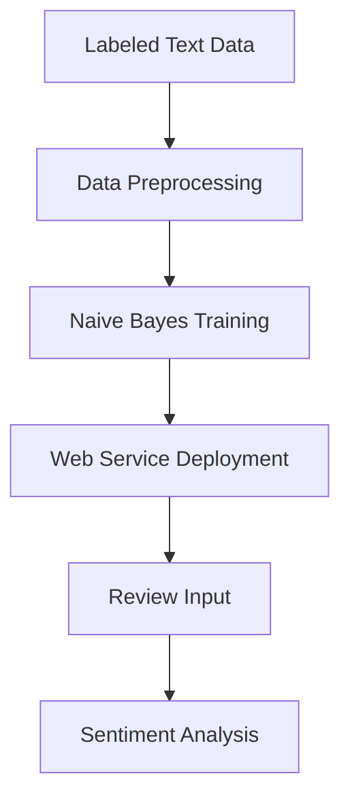

## 7. Support Vector Machines (SVM): Optimal Boundaries

SVM finds the hyperplane that best separates classes with maximum margin.

**Use Case:** SVM is used for handwriting recognition in digit classification tasks, such as processing handwritten checks or forms. It's also applied in bioinformatics for protein classification, in text categorization for document classification, and in image recognition for object detection. For example, postal services use SVM for automated mail sorting by recognizing handwritten addresses.

**Why It Matters:** For legacy systems reformers, SVM offers a bridge to modern ML without overhauling entire infrastructures.

**Sample Project:** This project uses the MNIST dataset of handwritten digits. You'll preprocess the images by flattening and normalizing, train an SVM classifier with different kernels (linear, polynomial, RBF), and tune hyperparameters like C and gamma. Visualize decision boundaries on a 2D subset using PCA. Evaluate performance with accuracy, precision, and recall. Plugin-ecosystem enthusiasts can package the trained model as a reusable library for digit recognition in various applications.

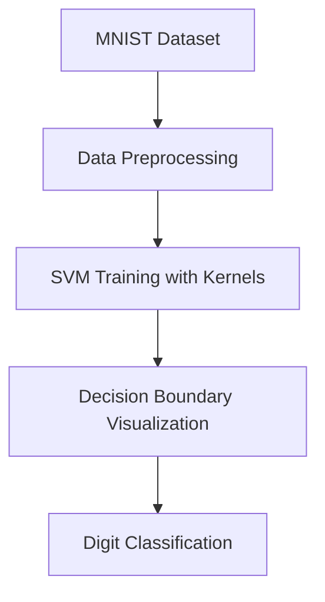

## 8. Neural Networks: Flexible Approximators

Neural networks consist of interconnected nodes (neurons) that learn complex patterns through backpropagation.

**Use Case:** Neural networks are used for facial recognition in security systems, enabling automated identification and access control. They are also applied in image classification for medical imaging (e.g., detecting tumors in X-rays), autonomous vehicles for object detection, and natural language processing for language translation. For example, social media platforms use neural networks for content moderation and personalized recommendations.

**Why It Matters:** Solo creators leverage neural networks for innovative products, balancing performance with local deployment via ONNX.

**Sample Project:** This project involves selecting a small dataset like CIFAR-10 for image classification. You'll build a neural network using TensorFlow or PyTorch with convolutional layers, train it on the dataset, and evaluate accuracy. Then, optimize the model for edge devices using quantization and pruning techniques. Independent consultants can use this as a deliverable for clients needing lightweight AI models for mobile or IoT applications.

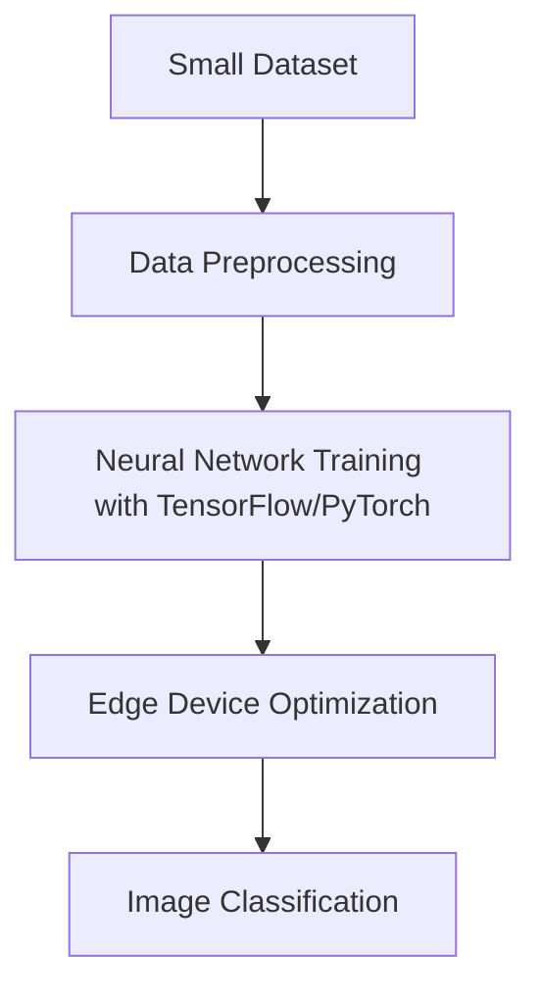

## 9. Gradient Boosting: High-Performance Ensembles

Gradient boosting builds models sequentially, each correcting the previous one's errors.

**Use Case:** Gradient boosting is used for credit scoring in financial services to predict loan defaults by analyzing applicant data such as credit history, income, and employment status. It's also applied in ranking systems for search engines, predicting customer lifetime value in marketing, and forecasting demand in supply chain management. For example, banks use gradient boosting models to assess risk and set interest rates for loans.

**Why It Matters:** Its efficiency makes it a go-to for enterprise applications requiring explainable AI.

**Sample Project:** This project uses a credit card dataset like the UCI Credit Card Default dataset. You'll preprocess the data, train an XGBoost classifier, perform feature importance analysis to identify key predictors, and evaluate with AUC-ROC. Deploy the model in a Docker container for production use. Startup co-founders can build this into a fintech platform for risk assessment.

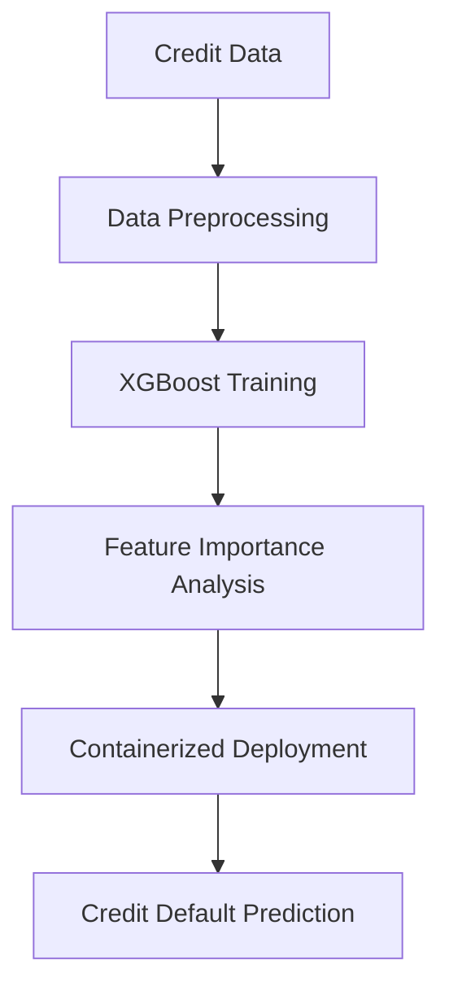

## 10. K-Nearest Neighbors (KNN): Instance-Based Learning

KNN classifies or regresses based on the majority vote or average of k nearest neighbors.

**Use Case:** KNN is used for movie recommendation systems by finding similar users or items based on ratings. It's also applied in image recognition for classifying images based on pixel similarity, in medical diagnosis for predicting diseases from patient data, and in anomaly detection for identifying outliers. For example, streaming services like Netflix use KNN-based collaborative filtering for personalized recommendations.

**Why It Matters:** Simple and interpretable, perfect for hobbyist experiments on limited hardware.

**Sample Project:** This project uses the MovieLens dataset of user ratings. You'll preprocess the data, implement KNN for collaborative filtering, calculate similarities between users or items, and generate recommendations. Create a simple web interface for users to input their ratings and receive movie suggestions. Freelance makers can customize this for niche markets like books or music.

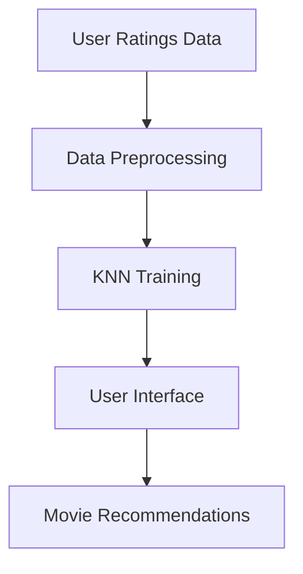

## 11. Principal Component Analysis (PCA): Dimensionality Reduction

PCA transforms high-dimensional data into a lower-dimensional space while preserving variance.

**Use Case:** PCA is used for image compression by reducing dimensionality while preserving essential features, and for noise reduction in data preprocessing. It's also applied in facial recognition for feature extraction, in genomics for analyzing gene expression data, and in finance for portfolio optimization. For example, image processing software uses PCA to compress images without significant quality loss.

**Why It Matters:** Essential preprocessing for researchers optimizing model efficiency.

**Sample Project:** This project uses a dataset of images like the Olivetti faces dataset. You'll apply PCA to reduce dimensionality, visualize the principal components, and reconstruct images with varying numbers of components to measure quality loss. DevOps engineers can integrate this into data pipelines for efficient storage and processing.

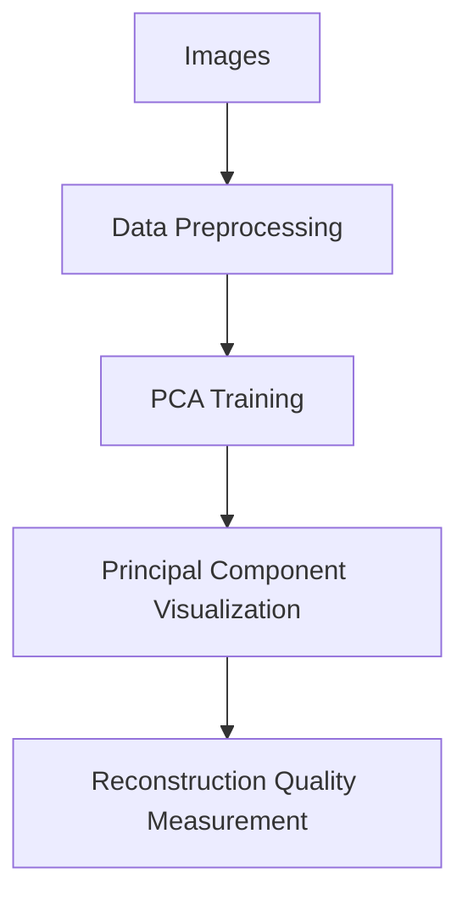

## 12. Recurrent Neural Networks (RNN): Sequence Processing

RNNs process sequential data by maintaining internal state across time steps.

**Use Case:** RNNs are used for sentiment analysis on text sequences, such as analyzing customer reviews or social media posts. They are also applied in language modeling for text generation, time-series forecasting for stock prices, and speech recognition for transcribing audio. For example, virtual assistants like Siri use RNNs for understanding spoken commands.

**Why It Matters:** Compact for local deployment, appealing to privacy-focused architects.

**Sample Project:** This project uses a dataset of social media posts like the Sentiment140 dataset. You'll preprocess the text, build an RNN using Keras, train it for sentiment classification, and compare accuracy with transformer models like BERT. Academic researchers can use this for benchmarking sequence models.

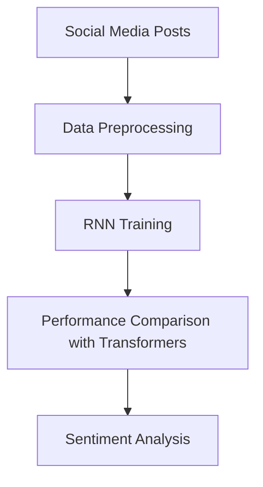

## 13. Genetic Algorithms: Evolutionary Optimization

Genetic algorithms mimic natural selection to optimize solutions.

**Use Case:** Genetic algorithms are used for supply chain optimization in logistics, such as routing and scheduling. They are also applied in engineering design for optimizing structures, in finance for portfolio optimization, and in machine learning for feature selection. For example, logistics companies use genetic algorithms to minimize delivery times and costs.

**Why It Matters:** Useful for complex, NP-hard problems in enterprise settings.

**Sample Project:** This project simulates a traveling salesman problem with cities and distances. You'll implement a genetic algorithm in Python using DEAP library, evolve populations of routes, and visualize convergence over generations. Product-driven developers can integrate this into logistics apps for route optimization.

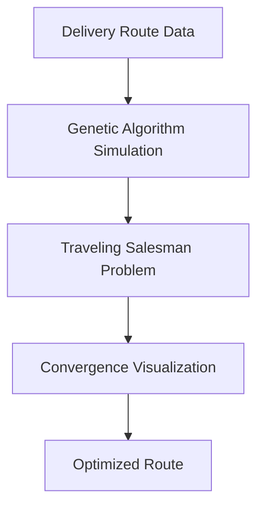

## 14. Long Short-Term Memory (LSTM): Enhanced Sequence Memory

LSTMs extend RNNs with gates to control information flow, capturing long-term dependencies.

**Use Case:** LSTMs are used for stock market prediction with time-series data, capturing long-term trends. They are also applied in language modeling for text generation, video analysis for action recognition, and healthcare for predicting patient deterioration from vital signs. For example, financial analysts use LSTMs to forecast market movements based on historical data.

**Why It Matters:** Self-hostable for side projects without heavy infrastructure.

**Sample Project:** This project uses historical stock price data from Yahoo Finance. You'll build an LSTM model in Keras, train it on time-series sequences, and predict future prices. Evaluate against ARIMA baselines. Side-hustle hackers can integrate this into a trading bot for automated decisions.

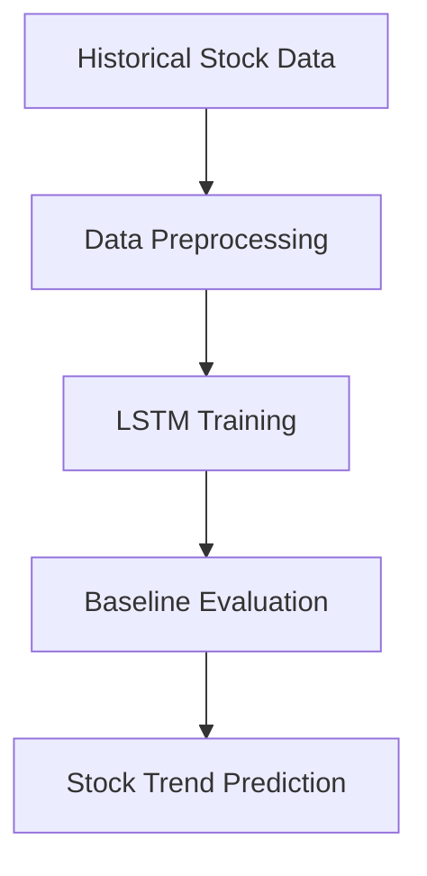

## 15. Natural Language Processing (NLP): Language Understanding

NLP encompasses techniques for processing and analyzing human language.

**Use Case:** NLP is used for customer support chatbots, enabling natural language understanding and response generation. It's also applied in sentiment analysis for social media monitoring, machine translation for global communication, and text summarization for content curation. For example, companies like Zendesk use NLP to automate customer inquiries and improve response times.

**Why It Matters:** Transformers enable powerful, local NLP for privacy-conscious applications.

**Sample Project:** This project uses NLTK or spaCy for NLP tasks. You'll build a simple intent classification chatbot, train it on a small dataset of user queries, and generate responses based on intents. Deploy locally with a web interface. AI plugin developers can extend this into VS Code extensions for code assistance.

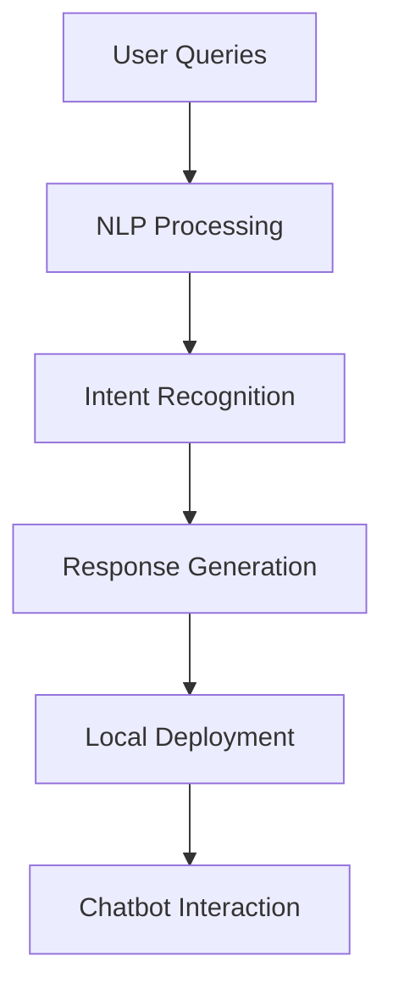

## 16. Ant Colony Optimization: Swarm Intelligence

Inspired by ant foraging, this algorithm finds optimal paths through pheromone trails.

**Use Case:** Ant Colony Optimization is used for solving the traveling salesman problem by finding optimal routes. It's also applied in network routing for data packets, vehicle routing in logistics, and scheduling problems in manufacturing. For example, logistics companies use it to optimize delivery routes and reduce fuel costs.

**Why It Matters:** Fun for educational projects and niche optimizations.

**Sample Project:** This project simulates a delivery network with cities and distances. You'll implement the Ant Colony Optimization algorithm in Python, simulate ant foraging for optimal routes, and visualize the pheromone trails and final paths. Hobbyists can experiment with parameters to explore swarm intelligence.

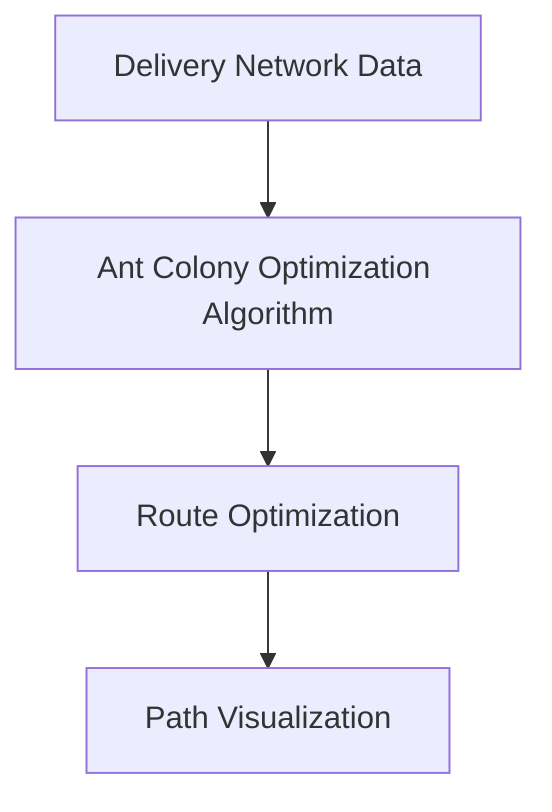

## 17. Word Embeddings: Semantic Representations

Word embeddings map words to vectors, capturing semantic relationships.

**Use Case:** Word embeddings are used for improving search engine relevance by capturing semantic meanings. They are also applied in machine translation for better language understanding, sentiment analysis for nuanced emotion detection, and recommendation systems for content similarity. For example, search engines like Google use word embeddings to understand query intent and provide more relevant results.

**Why It Matters:** Enhances NLP tasks without large models.

**Sample Project:** This project uses a text corpus like Wikipedia articles. You'll train word embeddings using Gensim's Word2Vec, explore semantic relationships (e.g., king - man + woman = queen), and build a similarity search tool. Tech curators can use this for content discovery and recommendation systems.

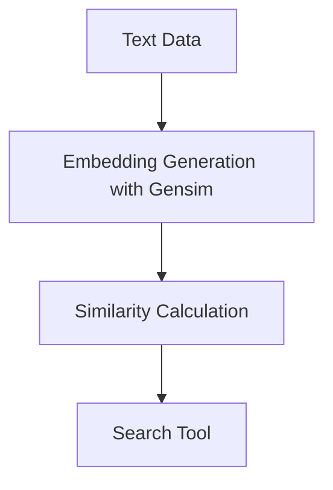

## 18. Gaussian Mixture Models (GMM): Probabilistic Clustering

GMM assumes data points are generated from a mixture of Gaussian distributions.

**Use Case:** GMM is used for network anomaly detection by modeling normal traffic patterns. It's also applied in speaker identification for voice biometrics, image segmentation for medical imaging, and customer behavior analysis for personalized marketing. For example, cybersecurity systems use GMM to detect unusual network activities indicative of intrusions.

**Why It Matters:** Probabilistic approach suits security-focused enterprises.

**Sample Project:** This project uses network traffic logs from KDD Cup dataset. You'll train a GMM to model normal behavior, set anomaly thresholds based on likelihood scores, and detect intrusions. Legacy reformers can integrate this into existing monitoring systems for enhanced security.

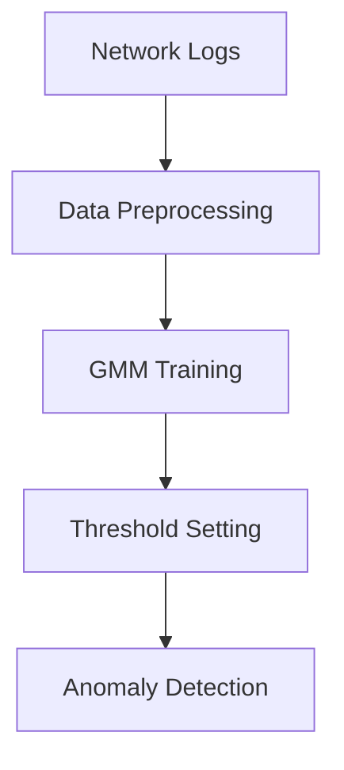

## 19. Association Rule Learning: Pattern Discovery

This method identifies relationships between variables in transactional data.

**Use Case:** Association Rule Learning is used for market basket analysis in retail to identify product associations. It's also applied in web usage mining for website optimization, medical diagnosis for symptom-disease relationships, and fraud detection for identifying suspicious patterns. For example, supermarkets use it to optimize product placements and cross-selling strategies.

**Why It Matters:** Uncovers actionable insights for e-commerce.

**Sample Project:** This project uses the Instacart dataset of grocery transactions. You'll apply the Apriori algorithm to find frequent itemsets and association rules, such as "bread and butter" co-purchases. Visualize the rules with network graphs. Freelance makers can monetize this by offering retail analytics services.

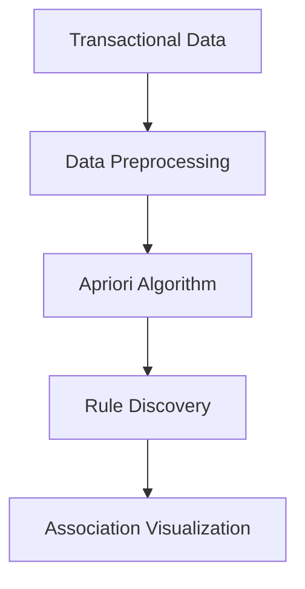

## 20. Reinforcement Learning: Trial-and-Error Learning

Agents learn optimal actions through rewards and penalties in an environment.

**Use Case:** Reinforcement Learning is used for game playing, such as AlphaGo defeating world champions. It's also applied in robotics for autonomous navigation, recommendation systems for personalized content, and autonomous vehicles for decision-making. For example, companies like DeepMind use RL for optimizing data center cooling and energy consumption.

**Why It Matters:** Enables autonomous systems for innovative products.

**Sample Project:** This project uses OpenAI Gym to train an agent for the CartPole game using Q-learning. You'll implement the Q-table, explore epsilon-greedy strategies, and visualize learning curves. Startup founders can prototype autonomous features for robotics or gaming.

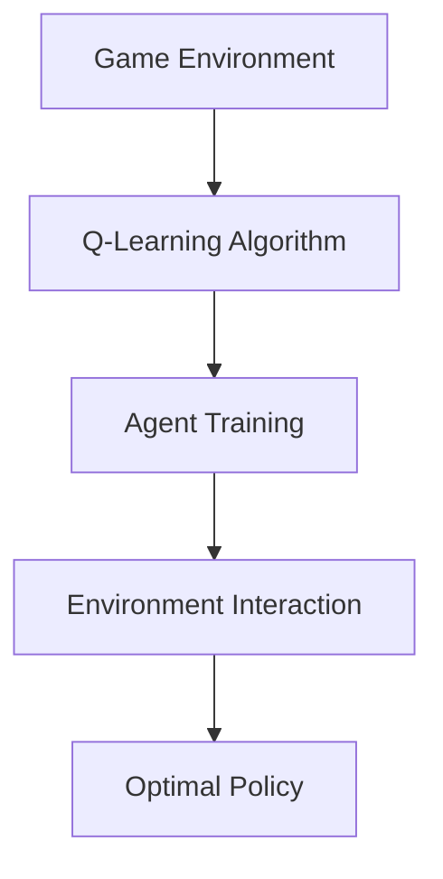

## Tailored Applications for Key Personas

### Solo AI Architects: Privacy-First Innovation with Local Models

As a solo AI architect, your focus is on building privacy-preserving applications that run entirely on-device, avoiding cloud dependencies and data privacy concerns. Algorithms like Principal Component Analysis (PCA) and Support Vector Machines (SVM) are your go-tos for dimensionality reduction and classification tasks that can be embedded directly into Rust or Python services.

For instance, you might develop a local image compression tool using PCA to reduce file sizes without uploading images to the cloud. By implementing SVM for anomaly detection in IoT sensor data, you ensure that sensitive data never leaves the user's device. This approach not only protects user privacy but also reduces latency and operational costs.

Your workflow often involves prototyping with scikit-learn or TensorFlow Lite, then optimizing for production using ONNX Runtime for cross-platform compatibility. Monetization comes from selling these tools as open-source libraries or SaaS alternatives that emphasize data sovereignty. Projects like a local recommendation engine for personal data or a privacy-focused health monitoring app can showcase your expertise, attracting clients who value ethical AI.

### Freelance Makers: Rapid Prototyping and Client Monetization

Freelance makers thrive on quick turnarounds and tangible deliverables for clients. Using scikit-learn, you can prototype segmentation tools with K-Means clustering or NLP widgets for sentiment analysis in days, not weeks. Your strength lies in adapting algorithms like Logistic Regression and Naive Bayes for real-world problems such as email filtering or customer feedback analysis.

Imagine building a custom dashboard for a small business that uses Random Forest to predict sales trends based on historical data. Or creating a chatbot prototype with RNNs for a startup's customer service. These projects not only demonstrate your coding skills but also provide immediate value, leading to repeat business.

To monetize, offer packages that include the model, a simple web interface, and documentation. Focus on niche markets like e-commerce personalization or content moderation, where clients need affordable, custom AI without the overhead of large teams. Tools like Streamlit for quick UIs and Docker for easy deployment make your offerings portable and professional.

### Enterprise Transitioners: Interpretable and Auditable Systems

Enterprise transitioners work in regulated environments where model explainability is paramount. Algorithms like Random Forest and Gradient Boosting provide the transparency needed for compliance, allowing you to modernize legacy systems while maintaining audit trails.

For example, you might replace outdated rule-based systems with a Random Forest model for credit risk assessment, where feature importance scores help explain decisions to regulators. In healthcare, Logistic Regression can predict patient outcomes with clear coefficients that align with clinical guidelines.

Your role involves bridging old and new tech, using tools like SHAP for model interpretability and integrating ML into existing enterprise stacks like SAP or Oracle. Success stories include reducing operational costs through predictive maintenance with SVM or optimizing supply chains with Genetic Algorithms. Focus on ROI-driven projects that demonstrate measurable improvements in efficiency and compliance.

### Hobbyist Hackers: Fun Learning on Limited Hardware

Hobbyist hackers experiment for the joy of discovery, often on personal laptops or Raspberry Pis. Simple algorithms like K-Nearest Neighbors (KNN) and Decision Trees are perfect for hands-on learning, running efficiently on local GPUs without needing massive datasets.

You might build a personal movie recommender using KNN on your Netflix history or a plant health monitor with Decision Trees analyzing sensor data from your garden. These projects teach fundamentals while being immediately useful.

Embrace the community aspect by sharing code on GitHub or participating in hackathons. Tools like Jupyter Notebooks for experimentation and libraries like scikit-learn keep things accessible. The goal isn't monetization but personal growth—perhaps contributing to open-source projects or starting a blog about your findings.

### Academic Researchers: Theoretical Depth and Validation

Academic researchers prioritize rigorous validation and theoretical understanding. Algorithms like Gaussian Mixture Models (GMM) and Genetic Algorithms allow deep dives into probabilistic modeling and evolutionary optimization, often for peer-reviewed publications.

For instance, you might use GMM for clustering gene expression data in bioinformatics, validating results against statistical tests. Or explore Genetic Algorithms for optimizing neural network architectures, contributing to the field of neuroevolution.

Your work involves extensive experimentation with tools like Python's SciPy for statistical analysis and visualization libraries like Matplotlib. Collaborate with peers through conferences and journals, where your findings on algorithm performance under various conditions can influence future research. Funding often comes from grants, so focus on novel applications that push boundaries.

### Startup Co-Founders: MVPs to Scalable Products

Startup co-founders need to move fast from idea to market. Start with Gradient Boosting for minimum viable products (MVPs) in areas like fraud detection or recommendation systems, then scale to Reinforcement Learning (RL) for competitive differentiation.

A classic example is using XGBoost for a predictive analytics dashboard that helps e-commerce startups forecast inventory needs. As the company grows, integrate RL for dynamic pricing that learns from user behavior.

Your toolkit includes agile frameworks like FastAPI for APIs and Kubernetes for scaling. Monetization strategies involve freemium models or enterprise subscriptions. Focus on user acquisition through demos that showcase algorithm-driven insights, positioning your startup as innovative yet reliable.

### Independent Consultants: End-to-End AI Solutions

Independent consultants offer comprehensive services, from data collection to deployment. Leverage Neural Networks and NLP for complex projects like custom chatbots or image recognition systems, providing clients with turnkey solutions.

For example, build a full-stack application using RNNs for time-series forecasting in finance, complete with data pipelines and monitoring. Or develop an NLP-powered content analyzer for marketing agencies.

Tools like Hugging Face for pre-trained models and AWS for cloud deployment (when needed) streamline your process. Charge premium rates for expertise in integrating AI into existing systems, emphasizing ROI through case studies. Networking at industry events helps build a client base.

### Product-Driven Developers: Robust, Scalable Products

Product-driven developers focus on building reliable, user-facing products. Ensembles like Random Forest and embeddings from Word2Vec ensure robustness in applications like search engines or personalization engines.

You might develop a SaaS platform using Gradient Boosting for predictive analytics, with embeddings enhancing recommendation accuracy. Ensure scalability with tools like Ray for distributed computing.

Monetization through subscriptions or usage-based pricing, with a focus on user experience. Iterate based on feedback, using A/B testing to validate algorithm improvements. Success metrics include user retention and feature adoption.

### Side-Hustle Hackers: Monetizing Personal Projects

Side-hustle hackers turn hobbies into income streams. Projects like stock predictors using LSTMs or recommenders with KNN can be monetized through Patreon, app stores, or freelance gigs.

For instance, create a mobile app for fitness tracking with clustering algorithms to group workout patterns, selling premium features. Or offer a subscription service for personalized news summaries using NLP.

Keep overhead low with free tools like Google Colab for development. Market through social media and indie platforms, building a community around your creations.

### DevOps Engineers: Integrating ML into Pipelines

DevOps engineers embed ML into CI/CD workflows. Use boosting algorithms and PCA for efficient model training and deployment in scalable pipelines.

For example, automate model retraining with Gradient Boosting in Jenkins pipelines, using PCA for data preprocessing to reduce compute costs.

Tools like MLflow for tracking and Docker for containerization are essential. Focus on reliability, with monitoring for model drift. Contribute to open-source DevOps tools for AI.

### AI Plugin Developers: Ecosystem Enhancement Tools

AI plugin developers create tools that integrate into larger ecosystems, like VS Code extensions. Clustering and NLP algorithms power features like code autocompletion or content analysis plugins.

Build a plugin using K-Means for data visualization in IDEs or NLP for smart search. Monetize through marketplace fees or premium versions.

Collaborate with communities, using APIs like OpenAI (locally via Ollama) for enhanced capabilities.

### Cross-Platform Architects: Optimized Mobile and Web Apps

Cross-platform architects design for multiple devices. Lightweight models like Logistic Regression and optimized Neural Networks ensure performance on mobile.

Develop apps using TensorFlow Lite for image classification or RNNs for voice interfaces, deploying via React Native.

Focus on battery efficiency and offline capabilities. Monetize through app stores or enterprise licensing.

### Tech Curators: Content and Community Building

Tech curators aggregate and explain AI knowledge. Use embeddings for content recommendation systems that suggest relevant articles or tutorials.

Build a platform using Word Embeddings to cluster tech topics, creating personalized learning paths.

Monetize through ads, sponsorships, or premium content. Engage communities via newsletters and podcasts.

### Plugin-Ecosystem Enthusiasts: Open-Source Contributions

Plugin-ecosystem enthusiasts develop and share open-source plugins. Algorithms like Association Rule Learning for code pattern discovery or GMM for anomaly detection in logs.

Contribute to projects like VS Code or Jupyter, focusing on usability. Build community through GitHub and forums.

Monetization via donations or consulting on custom plugins.

### Legacy Systems Reformers: Modernizing Outdated Infrastructure

Legacy systems reformers update old tech with AI. SVM and GMM bridge gaps, integrating ML without full rewrites.

For example, add predictive maintenance to manufacturing systems using SVM on sensor data.

Use tools like ONNX for model portability. Demonstrate value through pilot projects showing cost savings.

### Solo Creators: Innovative, Unique Offerings

Solo creators innovate with cutting-edge algorithms. Neural Networks and RL enable unique products like generative art tools or autonomous agents.

Develop a creative app using GANs for image generation or RL for game AI.

Monetize through platforms like Etsy for digital products or Patreon for exclusive content. Focus on storytelling and personal branding.

## Conclusion

Mastering these AI algorithms equips you to tackle diverse challenges, from predictive modeling to optimization. By focusing on practical implementations and persona-specific applications, you can build valuable solutions that respect privacy, leverage open-source tools, and drive innovation.

Start with simple projects, validate concepts, and scale as needed. The key is iterative development: experiment, learn, and refine. Whether for personal growth or business success, these algorithms provide a solid foundation for your AI journey.

 Explore additional tutorials and code examples in open-source repositories and community forums. Happy building!
