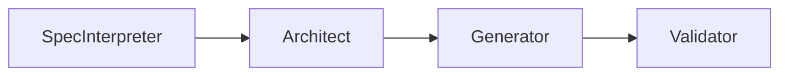

<div className="featured-image">
  
</div>

# Autonomous AI Agents: Building Distributed Systems with Local LLMs - Developer Portfolio

**Author:** Daniel Kliewer  
**Date:** January 12, 2026  
**GitHub:** [kliewerdaniel](https://github.com/kliewerdaniel)

---

## Introduction: When Return to Normalcy Becomes Impossible

In the wake of that loss, staring into the void of displacement, I found a clarifying question that would define the next two years of my engineering life:

**When return to normalcy is impossible, how do you reorganize?**

This is a technical manifesto. It is a portfolio documenting how I applied constraint-driven development to build **Computational Sovereignty**.

By rejecting cloud dependencies and embracing local-first architectures, I moved from survival to systems engineering. I built tools to resurrect memory, automate labor, and create agents that don't just chat, but *act*.

---

## The Technical Thesis

My work on GitHub is unified by three core architectural principles:

1. **Computational Sovereignty**: Reliance on local inference engines (Ollama, llama.cpp) to eliminate API costs and ensure total privacy.
2. **Deterministic Pipelines**: Moving beyond "vibes" to agentic workflows with verifiable, reproducible outputs.
3. **Memory Preservation**: Utilizing GraphRAG (Retrieval-Augmented Generation) to give agents persistent, structured context.

The result is a suite of autonomous systems that architect solutions, manage communities, and improve themselves through reinforcement learning loops.

---

## Core Projects: From Theory to Production

### 1. **SpecGen: Deterministic Code Generation via Agentic RAG**

**Repository:** [github.com/kliewerdaniel/specgen](https://github.com/kliewerdaniel/specgen)

**The Problem:** Conversational coding assistants hallucinate. They miss requirements, generate broken imports, and produce code that looks correct but fails validation.

**The Solution:** SpecGen is a CLI tool that utilizes a four-agent pipeline to transform Markdown specifications into production-ready application skeletons. It replaces probabilistic guesswork with deterministic architecture.



**Key Innovation:**
Unlike standard generative AI, SpecGen uses a **RAG-powered Architect Agent**. It consults a knowledge base of proven design patterns (FastAPI, Django, Next.js) to enforce best practices before a single line of code is written.

**Technical Stack:**

* **Inference**: Ollama (Local LLM)
* **Knowledge Base**: FAISS + Sentence Transformers
* **Validation**: Abstract Syntax Tree (AST) parsing and import resolution

**Impact:** Reduces project boilerplate time from hours to seconds, ensuring that every generated project is compilable, testable, and architecturally sound.


---

### 2. **MCBot01: The Local-First Full-Stack Foundation**

**Repository:** [github.com/kliewerdaniel/mcbot01](https://github.com/kliewerdaniel/mcbot01)

**The Problem:** Innovation in AI is often stalled by boilerplate. Every new local AI tool requires the same tedious scaffolding: a reactive UI, a backend API to handle timeouts, and a connector for local inference. Rebuilding this infrastructure for every experiment wastes critical cognitive energy.

**The Solution:** `mcbot01` is a production-ready **full-stack starter template** designed specifically for local LLM development. It bridges the gap between raw inference (Ollama) and user experience (Web UI), serving as the architectural spine for my more complex systems like the GraphRAG Research Assistant.

**Architecture:**
The system uses a decoupled architecture to ensure scalability and ease of modification:

* **Frontend:** Next.js with React & shadcn/ui for a responsive, chat-like interface.
* **Backend:** FastAPI (Python) for asynchronous request handling and business logic.
* **Inference:** Direct integration with Ollama for local model execution.

```typescript
// Core Logic: The Bridge between Frontend and Local Inference
// src/app/api/chat/route.ts (Simplified)

export async function POST(req: Request) {
  const { messages } = await req.json();
  
  // Forward request to Python/FastAPI backend
  const response = await fetch("http://localhost:8000/generate", {
    method: "POST",
    headers: { "Content-Type": "application/json" },
    body: JSON.stringify({ 
      prompt: messages[messages.length - 1].content,
      model: "mistral" // Runs locally via Ollama
    }),
  });

  // Stream the response back to the UI
  return new StreamingTextResponse(response.body);
}

```

**Key Features:**

* **Zero-Cost Infrastructure**: Runs entirely on local hardware (MacBook Pro M4/Consumer GPUs) without touching cloud APIs.
* **Modular Design**: The separation of concerns allows for swapping out the "brain" (Ollama models) or the "memory" (Vector DBs) without breaking the UI.
* **Streaming Support**: Built-in handling for server-sent events (SSE) to provide that essential "typing" feel of real-time AI generation.

**Why It Matters:** This repository represents the move from "scripting" to "software engineering." It was the force multiplier that allowed me to rapidly prototype and deploy complex tools like the **GraphRAG Research Assistant** without starting from zero. It is the standardized chassis upon which my autonomous agents are built.

---

### 3. **PersonaGen: Quantified AI Personalities**

**Repository:** [github.com/kliewerdaniel/PersonaGen](https://github.com/kliewerdaniel/PersonaGen)

**The Problem:** AI "personalities" are usually defined by vague prompts ("Be helpful," "Be sarcastic"). This leads to drift and inconsistency.

**The Solution:** A framework to **quantify psychological traits** as numerical weights (0.0 - 1.0).

```json
{
  "cognitive_style": {
    "abstraction": 0.9,
    "divergent_thinking": 0.95,
    "systematizing": 0.85
  },
  "communication_style": {
    "directness": 0.85,
    "emotional_transparency": 0.80
  }
}

```

**Technical Implementation:**

* **Trait Mapping**: Converts JSON schema into dynamic system prompts.
* **Feedback Loop**: Uses Reinforcement Learning from Human Feedback (RLHF) concepts to adjust weights based on output quality.
* **Application**: Used to power the "Simulacra" project—the digital resurrection of specific writing styles and personas.

**Why It Matters:** It turns "vibe" into "data." This allows for the precise tuning of an agent's behavior, essential for creating autonomous agents that need to act within strict behavioral guardrails.

---

### 4. **Insight Journal: Privacy-First AI Reflection**

**Repository:** [github.com/kliewerdaniel/insight-journal](https://github.com/kliewerdaniel/insight-journal)

**The Problem:** Personal journaling is vital for mental health, but traditional AI tools require sending your most private thoughts to the cloud.

**The Solution:** A static site generator (Jekyll) coupled with a local Python analysis pipeline.

**Workflow:**

1. User writes entry locally.
2. Local Python script utilizes **Llama 3** (via Ollama) to analyze the text for emotional trends, cognitive distortions, or historical parallels.
3. Analysis is appended to the entry metadata.
4. Site is rebuilt and deployed.

**Why It Matters:** It demonstrates that **privacy does not require sacrificing intelligence**. We can build deeply personal, AI-augmented tools that respect the user's data sovereignty.

---

### 5. **Orthos: The Self-Improving Framework**

**Repository:** [github.com/kliewerdaniel/orthos](https://github.com/kliewerdaniel/orthos)

**The Vision:** Moving from "Generative AI" to "Agentic AI."

Orthos is an experimental framework for **Self-Improving Coding Agents (SICA)**. It integrates the lessons from SpecGen and PersonaGen to create an agent capable of:

* **Meta-Cognition**: Planning its own tasks via a "Architect" persona.
* **Self-Correction**: Reading error logs and iteratively patching code.
* **Lifelong Learning**: Storing successful code patterns in a persistent knowledge graph for future use.

It utilizes the **Model Context Protocol (MCP)** to give the LLM "hands"—the ability to execute terminal commands, read file systems, and manage git repositories autonomously.

---

## Conclusion: Sovereignty as a Portfolio Strategy

This body of work represents a specific philosophy: **The future belongs to those who own their intelligence.**

By building systems that run locally, verify their own work, and remember their past interactions, we move beyond the era of the "chatbot" into the era of the **Digital Companion**.

I built these tools because I had to. When you have nothing, you build everything. These repositories are not just code; they are the reorganization of a life, compiled and deployed.

---

**Explore the Code:**

* [SpecGen](https://github.com/kliewerdaniel/specgen)
* [MCBot01](https://github.com/kliewerdaniel/mcbot01)
* [PersonaGen](https://github.com/kliewerdaniel/PersonaGen)
* [Orthos](https://github.com/kliewerdaniel/orthos)
* [Insight Journal](https://github.com/kliewerdaniel/insight-journal)

**Contact:**

* GitHub: [@kliewerdaniel](https://github.com/kliewerdaniel)
* Portfolio: [danielkliewer.com](https://danielkliewer.com)

---

<br>


<div className="video-embed">
  <iframe src="https://www.youtube.com/embed/eY21wTD7gfM" title="Autonomous Architectures - Distributed Agent Systems" frameborder="0" allow="accelerometer; autoplay; clipboard-write; encrypted-media; gyroscope; picture-in-picture; web-share" allowfullscreen></iframe>
</div>

<br>


<div className="video-embed">
  <iframe src="https://www.youtube.com/embed/gCjKNB0-zRQ" title="Autonomous Architectures - Distributed Agent Systems" frameborder="0" allow="accelerometer; autoplay; clipboard-write; encrypted-media; gyroscope; picture-in-picture; web-share" allowfullscreen></iframe>
</div>

*Built with: Python, Ollama, Neo4j, FastAPI, Next.js, and unbreakable will.*