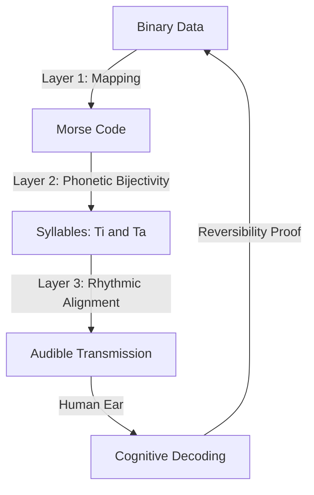

<iframe src="https://www.youtube.com/embed/7IA5gF_IuQs?si=z-vlKYYpghoz25KY" title="YouTube video player" frameborder="0" allow="accelerometer; autoplay; clipboard-write; encrypted-media; gyroscope; picture-in-picture; web-share" referrerpolicy="strict-origin-when-cross-origin" allowfullscreen></iframe>

<br>

<iframe  src="https://www.youtube.com/embed/GtlmhtbD0A8?si=L3FZ_UQkfxPpHE7m" title="YouTube video player" frameborder="0" allow="accelerometer; autoplay; clipboard-write; encrypted-media; gyroscope; picture-in-picture; web-share" referrerpolicy="strict-origin-when-cross-origin" allowfullscreen></iframe>


# The Biological API: Why AI Developers Should Care About Rhythmic Chanting

As AI developers, we spend our lives optimizing weights, pruning tensors, and worrying about the latent space of neural audio codecs like EnCodec or Lyra. We treat the transition from bits to sound as a purely computational problem solved by silicon. But what if the most robust, infrastructure-independent codec already exists in our own biology?

According to recent research into **Audible Binary Transmission**, the human vocal-auditory channel can function as a provably reversible, lossless encoding medium. By leveraging Morse code and specific phonetic rhythms, we can turn a human being into a high-reliability data transmission channel.

Today, we’re going to look at the architecture of this "Human Codec" and learn a specific **Russian Teaching Song** designed to hardcode these transmission rules into your own neural architecture.

---

## The Stack: Three Layers of Bijective Mapping

In traditional dev terms, this system isn't just "making noise." It's a three-layer transformation that ensures every bit of data can be perfectly reconstructed by a listener.

### 1. The Binary-to-Morse Layer
First, we take our raw binary input and map it to Morse code. This introduces "temporal expansion"—the message gets longer—but it preserves the information exactly. 

### 2. The Morse-to-Phoneme Layer
This is where it gets interesting. We don't use "dots" and "dashes." We use specific syllables:
*   **Dot (·) = "ти" (Ti)**
*   **Dash (−) = "та" (Ta)**

These aren't chosen at random. The sources explain that these phonemes are **acoustically distinguishable** (easy to tell apart even in noise) and **temporally equivalent** (they take the same amount of time to say), which preserves the rhythmic structure.

### 3. The Phoneme-to-Rhythm Layer
Finally, we apply a strict temporal structure. We use pauses to define letter boundaries and longer pauses for word boundaries. This turns the syllables into a "clocked" transmission.



---

## The "Song of the Code": A Human Readme

To teach this system, we use a mnemonic song. In this Russian version, every word is carefully chosen: words starting with **"Ти"** represent a **dot**, and words starting with **"Та"** represent a **dash**. 

By singing this, you aren't just memorizing a song; you are training your brain's "audio cortex" to recognize the rhythmic patterns of the code.

### Песня о Коде (Song of the Code)

**(Verse 1)**
**Ти**хий **Та**нец — это **А** (· −)
**Та**пок **Ти**хо **Ти**кает **Ти**ше — это **Б** (− · · ·)
**Ти**на **Ти**скает **Ти**грёнка — это **С** (· · ·)
**Та**ня **Та**щит **Та**зик — это **О** (− − −)

**(Chorus)**
**Ти** и **Та**, **Ти** и **Та**,
В голове лишь пустота!
Мы поём этот ритм,
Словно в космос летим!

**(Verse 2)**
**Ти**кает — это просто **Е** (·)
**Та**щит **Та**нк — это буква **М** (− −)
**Та**нец **Ти**хий — это **Н** (− ·)
**Ти**хо **Ти**хо **Та**нец — это **У** (· · −)

***

### English Translation (For Logic Verification)

**(Verse 1)**
**Ti**khiy **Ta**nets (Quiet Dance) — that is **A** (· −)
**Ta**pok **Ti**kho **Ti**kayet **Ti**she (Slipper quietly ticks quieter) — that is **B** (− · · ·)
**Ti**na **Ti**skayet **Ti**gryonka (Tina squeezes a tiger cub) — that is **S** (· · ·)
**Ta**nya **Ta**shchit **Ta**zik (Tanya drags a basin) — that is **O** (− − −)

---

## Why This Matters for AI Development

### 1. Organic Error Detection
In a typical TCP/IP stack, you have checksums. In this human codec, the **rhythm itself is the checksum**. The sources explain a concept called **Perceptual Error Salience**. Because humans have specialized brain mechanisms for "beat tracking" (located in the cerebellum), any deviation from the established rhythm—like a syllable being too long or a pause being missed—triggers a "prediction error" signal in the brain. You don't need to calculate parity; your brain "feels" the error.

### 2. The Cognitive Bottleneck (VRAM for Humans)
As developers, we are used to high bandwidth. But the human channel's capacity is limited by **working memory**, not acoustic bandwidth. While the theoretical limit of speech is about 10 bits per second, our practical rate is lower because we can only process about seven "chunks" of information at a time. This is why the song is so effective—it turns complex binary strings into "melodic chunks" that fit within our cognitive constraints.

### 3. Implementation in Python
If you wanted to automate the generation of these training songs or phonetic sequences, the logic is a simple injective mapping. Here is how you might represent the "Layer 2" phonetic transformation:

```python
def encode_to_phonetic_rhythm(binary_string):
    # Mapping table based on the source's bijective rules
    morse_map = {'A': '.-', 'B': '-...', 'S': '...', 'O': '---'}
    phoneme_map = {'.': 'ти', '-': 'та'}
    
    # Example: Simple ASCII conversion to Morse
    # (In a real system, this would handle raw binary)
    phonetic_output = []
    
    for char in binary_string:
        morse_code = morse_map.get(char.upper(), '')
        # Map dots to 'ti' and dashes to 'ta'
        phonemes = [phoneme_map[symbol] for symbol in morse_code]
        phonetic_output.append("-".join(phonemes))
        
    return " / ".join(phonetic_output)

# Inputting 'A' and 'B' (The first two lines of our song)
print(encode_to_phonetic_rhythm("AB")) 
# Output: ти-та / та-ти-ти-ти
```

---

## Conclusion: Information Sans Infrastructure

The most profound takeaway from the sources is **Infrastructure Independence**. Modern AI assumes a massive stack of physical hardware—wires, storage, and processing units. 

However, this rhythmic system demonstrates that digital information can be preserved and transmitted using **only biological systems**, provided the encoding is "cognitive-optimal." By aligning our data structures with our neural architecture (beat perception, phonemic categorization, and the phonological loop), we create a communication system that is resilient to infrastructure collapse.

Next time you're building a low-latency API, remember: sometimes the most efficient representation isn't the one that's easiest for the CPU to read, but the one that's easiest for the human brain to sing.